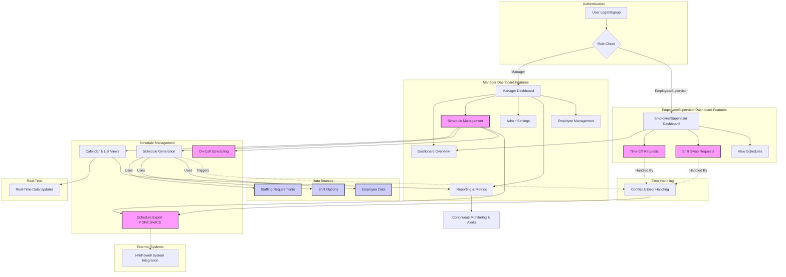

# 911 Dispatch Center Scheduling System

A comprehensive scheduling system built with Next.js 14, TypeScript, Supabase (using Supabase SSR), and Shadcn UI for managing 24/7 911 dispatch center staffing.

## Security

This project implements comprehensive security measures including:
- Supabase Auth with secure session management
- Row Level Security (RLS) policies
- Rate limiting and API protection
- Role-based access control
- Audit logging

For detailed security documentation, see [SECURITY.md](docs/SECURITY.md).

## Mermaid Chart


  
## Features

- **Authentication & Authorization**
  - Secure login leveraging Supabase Auth via SSR (using the modern @supabase/ssr module)
  - Role-based access (Supervisors vs. Employees)
  - Protected routes and API endpoints integrated within Next.js 14 App Router

- **Schedule Management**
  - Real-time staffing level monitoring
  - Shift assignment and management with support for multiple shift patterns:
    - **Pattern A:** Four consecutive 10-hour shifts
    - **Pattern B:** Three consecutive 12-hour shifts plus one 4-hour shift
  - Automatic supervisor coverage verification

- **Time-Off Management**
  - Request submission and approval workflow
  - Calendar integration with interactive scheduling views
  - Conflict detection to ensure balanced staffing

- **Staff Management**
  - Employee profiles and preferences management
  - Shift pattern assignment for streamlined scheduling
  - Weekly hours tracking and overtime management

## Tech Stack

- **Frontend:** Next.js 14 (App Router), TypeScript, Tailwind CSS
- **UI Components:** Shadcn UI (with modern shadcn commands) and Radix UI for accessible components
- **Backend:** Supabase (Database, Real-time updates, and Auth via Supabase SSR)
- **Authentication:** Secure user authentication using Supabase Auth with SSR, leveraging the new @supabase/ssr module for robust cookie and session management
- **Styling:** Tailwind CSS with custom configurations and reusable Shadcn UI components

## Development

### Available Commands

- `npm run dev` – Start the development server
- `npm run build` – Build the production bundle
- `npm run start` – Launch the production server
- `npm run lint` – Run ESLint for code quality checks
- `npm run type-check` – Run the TypeScript compiler to enforce type safety

### Database Management

- Start local Supabase: `supabase start`
- Reset database (apply migrations and seed data): `supabase db reset`
- Generate type definitions: `supabase gen types typescript --local > types/database.ts`

## Deployment

1. Configure the required environment variables on your hosting platform.
2. Set up and configure your production Supabase project.
3. Deploy using your preferred platform (e.g., Vercel):

   ```bash
   npm run build
   ```

## Contributing

1. Fork the repository.
2. Create your feature branch: `git checkout -b feature/my-feature`
3. Commit your changes: `git commit -am 'Add my feature'`
4. Push to the branch: `git push origin feature/my-feature`
5. Open a pull request.

