# Project Structure

## Overview

This document outlines the organization of the project's codebase.

```mermaid  
flowchart TD
  %% Frontend (Next.js App)
  subgraph FE[Frontend: Next.js Application]
    A1["Authentication (app/(auth))"]
    A2["Dashboard & Management (app/(dashboard))"]
    A3["Scheduling UI (app/schedule)"]
    A4["Shared UI & Feature Components (components/ui, components/shared, components/features)"]
  end

  %% Backend Server & API
  subgraph BE[Backend: Server & API]
    B1["API Routes (app/api)"]
    B2["Server Actions & Middleware (app/actions, middleware.ts)"]
    B3["Scheduling Module (lib/scheduling/generate.ts)"]
    B4["Utility Functions (lib/utils, lib/supabase)"]
  end

  %% Business Logic and Scheduling Rules
  subgraph BL[Business Logic]
    C1["Staffing Requirements"]
    C2["Employee Shift Patterns<br/>(Pattern A: 4x10hr, Pattern B: 3x12hr + 1x4hr)"]
    C3["Shift Options Matching<br/>(Early, Day, Swing, Graveyard)"]
    C4["Scheduling Constraints<br/>(40 hrs/wk cap, Time Off, Consistency)"]
    C5["Scheduling Priorities<br/>(Min Staffing, Supervisor Coverage, Fairness, Overtime)"]
  end

  %% Database (Supabase)
  subgraph DB[Supabase Database]
    D1["Employees Table"]
    D2["Shift Options Table"]
    D3["Schedule Periods Table"]
    D4["Staffing Requirements Table<br/>(Time Blocks with min staff & supervisor flag)"]
    D5["Shift Pattern Rules Table"]
    D6["Time Off Requests Table"]
    D7["Assigned Shifts (Individual Shifts) Table"]
    D8["Shift Swap Requests Table"]
    D9["Profiles Table"]
    D10["Auth Logs Table"]
    D11["System Settings Table"]
    D12["Other Supporting Tables & Views"]
    D13["DB Functions & Triggers<br/>(handle_new_user, set_updated_at, validate_session, etc.)"]
  end

  %% Testing and Integration
  subgraph TEST[Testing & Integration]
    T1["Unit Tests (__tests__/unit)"]
    T2["Integration Tests (__tests__/integration)"]
    T3["E2E Tests (__tests__/e2e)"]
  end

  %% Connections between Frontend and Backend
  A1 --> B1
  A2 --> B2
  A3 --> B3
  A4 --- A1
  A4 --- A2
  A4 --- A3

  %% Backend internal flow
  B1 --> B2
  B2 --> B3
  B3 --> B4
  B3 --> D1
  B3 --> D2
  B3 --> D3
  B3 --> D4
  B3 --> D5
  B3 --> D6
  B3 --> D7
  B3 --> D11

  %% Business Logic links
  B3 --> C1
  B3 --> C2
  B3 --> C3
  B3 --> C4
  B3 --> C5
  
  %% Database Functionality and Rules
  D13 --- D1
  D13 --- D9
  D13 --- D10

  %% Links between Business Logic and Database
  C1 --- D4
  C2 --- D5
  C3 --- D2
  C4 --- D6
  C5 --- D4

  %% Frontend -> Backend -> Database (End-to-End Flow)
  A3 --> B3
  B3 --> D7

  %% Testing connections
  T1 --- A1
  T1 --- A2
  T2 --- B1
  T2 --- B3
  T3 --- A3

  %% Visual Styling Notes
  classDef feStyle fill:#F0F8FF,stroke:#333,stroke-width:1px;
  classDef beStyle fill:#FFFACD,stroke:#333,stroke-width:1px;
  classDef dbStyle fill:#e6ffe6,stroke:#333,stroke-width:1px;
  classDef blStyle fill:#ffe6ff,stroke:#333,stroke-width:1px;
  classDef testStyle fill:#d3d3d3,stroke:#333,stroke-width:1px;

  class FE feStyle;
  class BE beStyle;
  class DB dbStyle;
  class BL blStyle;
  class TEST testStyle;
```

## Component Organization

### UI Components
- Located in `components/ui/`
- Base components from shadcn/ui
- Consistent styling and behavior
- Examples: Button, Input, Card

### Feature Components
- Located in `components/features/`
- Specific to business features
- Composed of UI components
- Examples: Calendar, ShiftEditor, EmployeeSelector

### Shared Components
- Located in `components/shared/`
- Used across multiple features
- Common layouts and error handling
- Examples: DashboardLayout, ErrorBoundary

## Best Practices

1. Component Structure
   - Use named exports
   - Include displayName
   - Add proper TypeScript types
   - Include JSDoc comments for complex props

2. File Organization
   - Group related components
   - Keep files focused and small
   - Use index files for exports

3. Testing
   - Co-locate test files
   - Use proper test utilities
   - Follow testing patterns

4. Styling
   - Use Tailwind CSS
   - Follow class ordering
   - Use cn utility for conditionals

## Dependencies

- Next.js 14 (App Router)
- TypeScript
- Supabase
- shadcn/ui
- Tailwind CSS
- date-fns
- React Query

## Development Guidelines

1. Component Creation
   - Start with UI components
   - Compose feature components
   - Add proper types
   - Include tests

2. State Management
   - Use React Query for server state
   - Local state with useState/useReducer
   - Context for shared state

3. Data Fetching
   - Server Components first
   - React Query for client state
   - Proper error handling

4. Performance
   - Lazy loading when needed
   - Proper suspense boundaries
   - Optimistic updates
