# Project Structure

## Overview

This document outlines the interactions between the frontend and backend of the project.

```mermaid  
flowchart TD
  %% Frontend Group
  subgraph FE[Frontend Layer]
    subgraph Pages[Server Pages]
      P1["Authentication Pages\n(app/(auth))"]
      P2["Dashboard Pages\n(app/(dashboard))"]
      P3["Schedule Pages\n(app/schedule)"]
      P4["Shift Options Page\n(app/(dashboard)/shift-options)"]
    end

    subgraph Components[Client Components]
      C1["Auth Forms\n(components/auth)"]
      C2["Data Tables\n(components/tables)"]
      C3["Dialogs & Modals\n(components/dialogs)"]
      C4["UI Components\n(components/ui)"]
    end

    subgraph Loading[Loading & Error States]
      L1["Loading Skeletons\n(*/loading.tsx)"]
      L2["Error Boundaries\n(*/error.tsx)"]
      L3["Not Found\n(*/not-found.tsx)"]
    end

    subgraph RT[Real-time Updates]
      RT1["Schedule Updates"]
      RT2["Shift Changes"]
      RT3["Time Off Updates"]
    end
  end

  %% Middleware Layer
  subgraph MW[Middleware]
    M1["Auth Middleware\n(middleware.ts)"]
    M2["Error Handler\n(error.ts)"]
    M3["Real-time Handler\n(realtime.ts)"]
  end

  %% Backend Group
  subgraph BE[Backend Layer]
    subgraph Server[Server Components]
      S1["Page Components\n(*/page.tsx)"]
      S2["Layouts\n(*/layout.tsx)"]
      S3["Server Actions\n(*/actions.ts)"]
    end

    subgraph API[API Routes]
      A1["Schedule API\n(app/api/schedules)"]
      A2["Shift Options API\n(app/api/shift-options)"]
      A3["Employee API\n(app/api/employees)"]
    end

    subgraph Lib[Libraries]
      LB1["Supabase Client\n(lib/supabase)"]
      LB2["Schedule Generator\n(lib/schedule)"]
      LB3["Utils & Helpers\n(lib/utils)"]
    end
  end

  %% Business Logic Layer
  subgraph BL[Business Logic]
    subgraph Rules[Scheduling Rules]
      SR1["Shift Patterns\n(4x10 or 3x12+4)"]
      SR2["Time Constraints\n(40hr weekly cap)"]
      SR3["Coverage Requirements\n(min staff per period)"]
    end

    subgraph Validation[Validation Logic]
      V1["Pattern Validator"]
      V2["Schedule Validator"]
      V3["Time Off Validator"]
    end

    subgraph Generation[Schedule Generation]
      G1["Pattern Matcher"]
      G2["Coverage Optimizer"]
      G3["Conflict Resolver"]
    end
  end

  %% Database Group
  subgraph DB[Supabase Database]
    subgraph Auth[Authentication]
      AU1["auth.users"]
      AU2["auth.sessions"]
    end

    subgraph Data[Application Data]
      D1["employees"]
      D2["shift_options"]
      D3["schedules"]
      D4["assigned_shifts"]
      D5["time_off_requests"]
      D6["shift_pattern_rules"]
      D7["staffing_requirements"]
    end

    subgraph Security[RLS Policies]
      R1["Employee Access"]
      R2["Manager Access"]
      R3["Admin Access"]
    end
  end

  %% Testing Group
  subgraph TEST[Testing]
    T1["Unit Tests\n(__tests__/unit)"]
    T2["Integration Tests\n(__tests__/integration)"]
    T3["E2E Tests\n(playwright)"]
  end

  %% Connections
  %% Auth Flow
  P1 --> M1
  M1 --> S1
  M1 --> AU1

  %% Page Flow
  P2 --> M1
  P3 --> M1
  P4 --> M1

  %% Server Actions
  S1 --> LB1
  S3 --> LB1
  
  %% Client to Server
  C1 --> S3
  C2 --> S3
  C3 --> S3

  %% Loading States
  L1 -.-> Pages
  L2 -.-> Pages
  L3 -.-> Pages

  %% Error Handling
  M2 --> L2
  S1 --> M2
  S3 --> M2

  %% Real-time Updates
  RT1 --> M3
  RT2 --> M3
  RT3 --> M3
  M3 --> LB1

  %% API Layer
  A1 --> LB1
  A2 --> LB1
  A3 --> LB1

  %% Business Logic Flow
  LB2 --> SR1
  LB2 --> SR2
  LB2 --> SR3
  
  SR1 --> V1
  SR2 --> V2
  SR3 --> V3
  
  V1 --> G1
  V2 --> G2
  V3 --> G3
  
  G1 --> D4
  G2 --> D4
  G3 --> D4

  %% Database Access
  LB1 --> Auth
  LB1 --> Data

  %% Security
  Auth --> R1
  Auth --> R2
  Auth --> R3

  R1 --> Data
  R2 --> Data
  R3 --> Data

  %% Data Relationships
  D1 --> D3
  D2 --> D4
  D3 --> D4
  D5 --> D4
  D6 --> D4
  D7 --> D4

  %% Testing
  T1 --> LB3
  T2 --> A1
  T2 --> A2
  T2 --> A3
  T3 --> FE

  %% Style
  classDef error fill:#ff6b6b,stroke:#ff6b6b,color:white
  classDef realtime fill:#4ecdc4,stroke:#4ecdc4,color:white
  classDef auth fill:#45b7d1,stroke:#45b7d1,color:white
  
  class L2,M2 error
  class RT1,RT2,RT3,M3 realtime
  class M1,AU1,AU2 auth
```

## Additional Scheduling Context

To develop a comprehensive 24/7 schedule for a 911 dispatch center that meets specific staffing requirements, consider the following structured approach:

1. **Staffing Requirements:**
   - **Morning (5:00 AM – 9:00 AM):** Minimum of 6 employees, including 1 shift supervisor.
   - **Daytime (9:00 AM – 9:00 PM):** Minimum of 8 employees, including 1 shift supervisor.
   - **Evening (9:00 PM – 1:00 AM):** Minimum of 7 employees, including 1 shift supervisor.
   - **Night (1:00 AM – 5:00 AM):** Minimum of 6 employees, including 1 shift supervisor.

2. **Employee Shift Patterns:**
   - **Pattern A:** Four consecutive 10‑hour shifts.
   - **Pattern B:** Three consecutive 12‑hour shifts plus one 4‑hour shift, scheduled consecutively.

3. **Shift Options:**
   - **Early Shift:** Options include 5:00 AM–9:00 AM (4‑hr), 5:00 AM–3:00 PM (10‑hr), 5:00 AM–5:00 PM (12‑hr)
   - **Day Shift:** Options include 9:00 AM–1:00 PM (4‑hr), 9:00 AM–7:00 PM (10‑hr), 9:00 AM–9:00 PM (12‑hr)
   - **Swing Shift:** Options include 1:00 PM–5:00 PM (4‑hr), 3:00 PM–1:00 AM (10‑hr), 3:00 PM–3:00 AM (12‑hr)
   - **Graveyard Shift:** Options include 1:00 AM–5:00 AM (4‑hr), 7:00 PM–5:00 AM (10‑hr), 5:00 PM–5:00 AM (12‑hr)

4. **Scheduling Constraints:**
   - Employees must not exceed 40 hours per week without managerial approval.
   - Schedules are planned in four‑month blocks with consistent weekly patterns.
   - Time off requests must be integrated: approved requests are honored, and pending ones are accommodated when possible.
   - Employees should generally work the same shift type on their scheduled days.

5. **Scheduling Priorities:**
   - **Primary Objective:** Ensure minimum staffing levels for each time period.
   - **Supervisor Coverage:** Guarantee at least one supervisor per period.
   - **Employee Preferences:** Factor in default shift types and time off requests.
   - **Pattern Adherence:** Schedule employees based on their assigned patterns.
   - **Fairness & Optimization:** Distribute shifts equitably and minimize unfulfilled staffing requirements and overtime.

All these variables are handled by the scheduling module (`lib/scheduling/generate.ts`) and integrated into our database through an **Assigned Shifts Table** that tracks individual employee assignments per day. Note that the minimum counts and supervisor requirement flags are maintained in the **Staffing Requirements Table**.